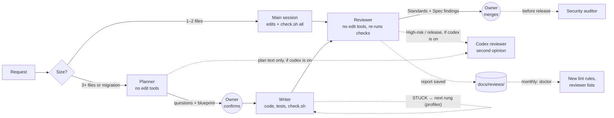

<p align="center"></p>

<h1 align="center">Claude Kit</h1>

<p align="center">
  <strong>A drop-in engineering workflow for <a href="https://claude.com/claude-code">Claude Code</a>.</strong><br>
  Fewer tokens, fewer silent decisions, and a written trail of what was actually checked.
</p>

<p align="center">
  <a href="LICENSE"></a>
  <a href="https://github.com/sam-pop/claude-code-workflow-kit/actions/workflows/check.yml"></a>
  
  
  
</p>

<p align="center">
  This repo passes its own checks: the kit is installed at its root, and CI runs <code>scripts/check.sh all</code> on Linux and the test suite under macOS <code>/bin/bash</code> 3.2 on every change.
</p>

---

Claude Kit is a set of templates, agents, hooks and scripts you install into a repository. A Claude Code session then **tailors it to that repo's stack**, and from that point every change runs through a short, verifiable process: plan, implement, check, review. Claude follows that process instead of improvising one each time.

It's for anyone using Claude Code on real projects who needs to **trust the result**: to know what the agent decided on its own, what was actually tested, and what still needs a human eye. It works the same whether you code alone, on a team, or mostly review code that others (or agents) wrote.

## TL;DR

**Get started.** You need Claude Code v2.1.292 or later, `git`, `bash` and `python3`; `gitleaks` and `semgrep` for the security check.

```bash
git clone https://github.com/sam-pop/claude-code-workflow-kit.git
claude-code-workflow-kit/scripts/install.sh /path/to/your-repo
```

Then open Claude Code in your repo and say **Read TAILOR.md and tailor the kit to this repo.** It asks one round of questions, wires `scripts/check.sh` to your real lint, test and build commands, and runs it. Review and commit the result. If other people commit to that repo, read [Choosing a tier](#choosing-a-tier) first: hooks run code on your machine.

**Use it.** For a small fix, say "Fix X, run check.sh all, then the reviewer agent." For a larger change, say "Run the planner on X", answer its questions, then "Now the writer, then the reviewer."

**Upgrade.** Update your clone of the kit, then run the installer in upgrade mode:

```bash
git -C claude-code-workflow-kit pull
claude-code-workflow-kit/scripts/install.sh --upgrade /path/to/your-repo
```

Then say **Read .claude/kit-upgrade.md** in your repo. Files you changed are never overwritten: the kit's new version arrives beside them as `.kit` files, with the version you installed from as `.kit-base`, and that session merges them three-way, so only lines both you and the kit changed need a decision. What changed in each release: [CHANGELOG.md](CHANGELOG.md).

**Extras.** A fresh install is the core process. Model profiles, a Codex second opinion, review verification and review stats are extras, off until you run `scripts/extras.sh on <name>`; see [Core and extras](#core-and-extras).

Details for each step: [Quick start](#quick-start), [Daily use](#daily-use), [Upgrading the kit](#upgrading-the-kit).

---

## Contents

- [TL;DR](#tldr)
- [What makes it different](#what-makes-it-different)
- [Core and extras](#core-and-extras)
- [Why this exists](#why-this-exists)
- [Principles](#principles)
- [How it works](#how-it-works)
- [Tell Claude Code](#tell-claude-code)
- [Quick start](#quick-start)
- [Choosing a tier](#choosing-a-tier)
- [Cross-model review (Codex)](#cross-model-review-codex)
- [Daily use](#daily-use)
- [Repository layout](#repository-layout)
- [What's in the box](#whats-in-the-box)
- [The agents](#the-agents)
- [Hooks and guardrails](#hooks-and-guardrails)
- [The improvement loop](#the-improvement-loop)
- [Measuring whether it works](#measuring-whether-it-works)
- [Model profiles and cost (vendor measurements)](#model-profiles-and-cost-vendor-measurements)
- [When things go wrong](#when-things-go-wrong)
- [Upgrading the kit](#upgrading-the-kit)
- [Security model and limitations](#security-model-and-limitations)
- [FAQ](#faq)
- [Contributing](#contributing)
- [Credits](#credits)
- [Disclaimer](#disclaimer)
- [License](#license)

## What makes it different

- **One verification contract.** Every agent, hook and CI run checks through `scripts/check.sh`. A check nobody configured exits 2 (`NOT CONFIGURED`) instead of passing, so no report can say "lint passed" for a check that never ran.
- **Decided and open are separate, and dated.** `docs/decisions.md` holds what is decided, with dates; `docs/open.md` holds what is not, each with an owner and a decide-by date. Agents design around open items and list every default they picked.
- **Kill criteria before you start.** With the metrics extra, you commit to a baseline and to the conditions under which you shrink the kit, before the first change goes through it.
- **Codex egress by design.** With the codex extra on, nothing is sent without a gitleaks scan, Codex starts in an empty directory and receives one prompt (the diff with 20 lines of context, or the plan text), and a finding refuses the run. See [Cross-model review](#cross-model-review-codex).

Only *what was actually tested* is checked mechanically: the reviewer re-runs the checks and compares exit codes and test counts. *What the agent decided* and *what still needs a human* are lists the agents write themselves; the reviewer reads them, nothing verifies them.

## Core and extras

The kit is a baseline of good engineering practice for Claude Code, not a replacement for how you already work. A fresh install is the **core**:

- the planner, writer, reviewer and security-auditor agents, and the rule for when each runs;
- `scripts/check.sh` as the single verification entry point, and `scripts/doctor.sh` for kit hygiene;
- the lint hook and the hook that saves each review to `docs/reviews/`;
- `docs/conventions.md`, `docs/decisions.md`, `docs/open.md` and the risk tiers in `docs/rollout.md`.

Everything else is an **extra**, off in a fresh install. An extra is its files: dormant in `.claude/optional/`, active at `.claude/agents/` or `scripts/`. Core scripts call an extra's script only when it is active, so with every extra off the core keeps no state. Start with none for the first two weeks, then add one when you can say what it should fix.

| Extra | Adds | Switch on |
|---|---|---|
| `profiles` | Model and effort per agent, risk-scaled review effort, the writer ladder | `scripts/extras.sh on profiles`, then `scripts/set-models.sh <lite\|standard\|max>` |
| `codex` | A Codex second opinion on the plan, on High-risk diffs and before a release | `scripts/extras.sh on codex` |
| `verify-review` | A `### Verification` block on each saved review: are the quoted lines in the files, was every changed file read | `scripts/extras.sh on verify-review` |
| `metrics` | Review-log counts and the agreement rate in `check.sh doctor` | `scripts/extras.sh on metrics` |

Every extra is exactly one file. `scripts/extras.sh status` shows which are on and warns about one that exists in both places; `off <name>` switches one back. Switching moves that file and edits nothing else. Record the choice in `docs/decisions.md`. One section per extra: `docs/rollout.md`, Extras.

**Upgrades keep what each repo had.** A repo installed from 1.5 or later keeps every extra it ran; one installed from 1.4 gets `profiles` and `metrics` on, `verify-review` off, and `codex` as it was. Two extras were retired in 1.8, `stop-warning` and the repeated-failure counter (`stuck-detect.sh`, half of `profiles`): a repo that had them keeps their files, listed as retired. See [Upgrading the kit](#upgrading-the-kit).

## Why this exists

Coding agents fail in predictable ways:

| Failure | What it looks like | How the kit answers it |
|---|---|---|
| **Silent decisions** | The agent quietly picks a timeout, a library, a product behaviour nobody asked for | `docs/open.md` holds what is undecided; agents design around it. The writer must list every default it picked. |
| **Claimed verification** | "All tests pass" when tests were skipped, filtered, or never configured | Unconfigured checks fail by design. The writer pastes real output. The reviewer re-runs the checks and compares. |
| **Context bloat** | A `CLAUDE.md` that grew into a 300-line changelog, loaded on every turn | `CLAUDE.md` is an index capped at 150 lines and checked in CI. Agents without edit tools skip it entirely. |
| **Prompt-encoded linting** | Agents spending expensive tokens on what `grep` could catch | Every rule is either **mechanical** (in `scripts/check.sh`) or **judgment** (for the reviewer). Never both, never neither. |
| **Self-grading** | The model that wrote the code also decides it's fine | A separate reviewer with no edit tools and a fresh context reads the diff *before* the plan. |
| **Process theatre** | Rules nobody maintains, metrics nobody reads | With the metrics extra, metrics and kill criteria are fixed before you start. If the kit doesn't pay for itself, you shrink it. |

## Principles

1. **Mechanical before judgment.** If a tool can check it, it lives in `scripts/check.sh`, never in a prompt.
2. **Decisions have one home.** Decided things go in `docs/decisions.md`; undecided things go in `docs/open.md`, with an ID, an owner and a decide-by date.
3. **Few agents, clear handoffs.** Planner, writer, reviewer, and a security auditor for releases, plus an optional fifth: a Codex second opinion, off by default. Each has a defined input and a defined output.
4. **Honest reports, independently checked.** Nothing is "verified" until a second context has re-run it.
5. **`CLAUDE.md` is an index, not a log.** History belongs in git.
6. **The human is the gate.** Pushes, merges, open items and accepted risks belong to a person.
7. **The kit has to earn its place.** It is measured against your pre-kit baseline and cut back if it loses.

## How it works


```mermaid
flowchart LR
    R[Request] --> S{Size?}
    S -- "1–2 files" --> M[Main session<br/>edits + check.sh all]
    S -- "3+ files or migration" --> P[Planner<br/>no edit tools]
    P -- "questions + blueprint" --> O((Owner<br/>confirms))
    O --> W[Writer<br/>code, tests, check.sh]
    M --> V[Reviewer<br/>no edit tools, re-runs checks]
    W --> V
    V -- "Standards + Spec findings" --> H((Owner<br/>merges))
    H -. "before release" .-> A[Security auditor]
    V -. "High-risk / release, if codex is on" .-> X[Codex reviewer<br/>second opinion]
    P -. "plan text only, if codex is on" .-> X
    W -. "STUCK → next rung (profiles)" .-> W
    V -. "report saved" .-> L[(docs/reviews/)]
    L -. "monthly: doctor" .-> K[New lint rules,<br/>reviewer lists]
```

- **Small changes** skip the planner and writer: the main session edits, runs the checks, and the reviewer looks at the diff. Two contexts instead of four.
- **Larger changes** start with a planner that commits to one approach, names the alternative it rejected, and returns questions with recommended answers for you to confirm in a single reply.
- **Every review** is saved automatically. Once a month, recurring findings become lint rules and recurring false alarms become reviewer exceptions.

## Tell Claude Code

Copy one of these into Claude Code in your repository; the upgrade one also works in Codex. Each one says what to run and what to show you; for everyday work, see [Daily use](#daily-use).

**Install and tailor** (Claude Code):

```text
Install Claude Kit into this repo: clone https://github.com/sam-pop/claude-code-workflow-kit into a temporary folder outside this repo, run its scripts/install.sh with this repo's path, and show me the output. Then read TAILOR.md and tailor the kit to this repo.
```

**Upgrade** (Claude Code or Codex):

```text
Upgrade Claude Kit in this repo: pull the latest kit into my clone at <path> (or clone it into a temporary folder), run its scripts/install.sh --upgrade --dry-run on this repo (add --base <kit commit I installed from> if this repo predates kit 1.4) and show me the classification. When I say go, run it without --dry-run, then read .claude/kit-upgrade.md and follow it. Do not commit.
```

**Turn on an extra** (Claude Code):

```text
Turn on the profiles extra with the standard profile: run scripts/extras.sh on profiles, then scripts/set-models.sh standard, and record it in docs/decisions.md.
```

```text
Turn on the codex extra: run scripts/extras.sh on codex and check that the codex CLI and gitleaks are installed. Remind me that it sends diffs to OpenAI. Record it in docs/decisions.md.
```

**Monthly check** (Claude Code):

```text
Run scripts/check.sh doctor and tell me what to fix, most important first.
```

**Before a release** (Claude Code; Shared and Review-only tiers):

```text
Run the security-auditor agent on this repo and write its report to docs/security.md. List any Critical or High finding first; those block the release.
```

## Quick start

### Requirements

- [Claude Code](https://claude.com/claude-code) v2.1.292 or later (the Agent tool's per-call `effort`, used by the profiles extra's writer ladder and risk-scaled review)
- `git`, `bash`, `python3`
- [`gitleaks`](https://github.com/gitleaks/gitleaks) and [`semgrep`](https://semgrep.dev) for `check.sh security`

```bash
brew install gitleaks
pip install semgrep
```

On Linux (as in `template/.github/workflows/check.yml`), check the download against its published sha256 before unpacking it:

```bash
curl -sSfL -o gitleaks.tgz https://github.com/gitleaks/gitleaks/releases/download/v8.30.1/gitleaks_8.30.1_linux_x64.tar.gz
echo "551f6fc83ea457d62a0d98237cbad105af8d557003051f41f3e7ca7b3f2470eb  gitleaks.tgz" | sha256sum -c -
sudo tar -xzf gitleaks.tgz -C /usr/local/bin gitleaks
pipx install semgrep==1.184.0
```

semgrep is pinned by version only (PyPI publishes no checksum the workflow checks); gitleaks is pinned by version and sha256.

### Install into a repository

```bash
git clone https://github.com/sam-pop/claude-code-workflow-kit.git
claude-code-workflow-kit/scripts/install.sh /path/to/your-repo
```

The installer **never overwrites**. If a file already exists, the kit's version is written beside it as `<name>.kit` for you to merge (on an upgrade, with a `<name>.kit-base` for a three-way merge). It also writes `.claude/kit-version` and `.claude/kit-manifest` so a later [upgrade](#upgrading-the-kit) can tell an untouched file from a tailored one; commit both.

### Tailor it

Open Claude Code in the repo (`cd /path/to/your-repo && claude`) and say:

> Read TAILOR.md and tailor the kit to this repo.

The session explores the stack and conventions, asks you one round of questions with a recommended answer each (reply "yes" to accept them all), fills every placeholder, wires `scripts/check.sh` to your real lint, test and build commands, removes what your tier doesn't use, runs `scripts/check.sh all` and pastes the output into its report with the follow-ups (lint rules still to write, checks still unconfigured). Review the result and commit it.

> [!IMPORTANT]
> Until `scripts/check.sh` is configured, every check **fails on purpose**. That way nobody can report "lint passed" for a check that never ran.

## Choosing a tier

The tailoring session asks which tier fits. Pick by blast radius, not by repo size.

| Tier | Use when | What's installed |
|---|---|---|
| **Script** | Automations, glue code, one-file tools | `CLAUDE.md`, `check.sh`, short conventions |
| **Solo** | One engineer, low blast radius | Full docs; main session + reviewer; planner and writer for larger changes |
| **Shared** | Client work, money or personal data, a second contributor | Everything; reviewer required before merge; security auditor before releases |
| **Review-only** | Other people write the code; you are the reviewer of record | Reviewer + security auditor in **your own workspace**, with nothing installed in their repo |

> [!WARNING]
> **Review-only repos get no hooks.** Hooks run shell commands on your machine. In a repo others commit to, a PR that edits `.claude/settings.json`, `scripts/` or any file your linters, formatters, tests or build execute would run its code the next time you open Claude Code there. See [Security model](#security-model-and-limitations).

## Cross-model review (Codex)

Off by default; an extra. `scripts/extras.sh on codex` moves `codex-reviewer` from `.claude/optional/` into `.claude/agents/` (`off` moves it back).

- **When it runs.** On the planner's blueprint before your question round (`scripts/codex-review.sh plan <file>`; only the plan text is sent), after the reviewer on High-risk diffs, and once before a release. It is a **second opinion to triage, never a gate**: where it agrees with the Claude reviewer, confidence goes up; what only it raised gets your attention.
- **How.** The agent only relays `scripts/codex-review.sh`, on `gpt-6.1-sol` at effort `high`. A ChatGPT Plus subscription gives it a quota separate from your Claude plan.
- **Egress.** Codex gets one prompt and nothing else: the plan text, or the diff (20 lines of context) with the reviewer checklist and `docs/conventions.md` from the base branch. It starts in an empty directory. gitleaks is required (without it nothing is sent) and scans that prompt once; a finding, a gitleaks that cannot run, or a secrets-file name in the change **refuses the run**. The scan is a **best-effort guard against accidents, not a security boundary**: the eight guarantees, each with a test, and the blind spots are in [`docs/rollout.md`](template/docs/rollout.md#codex), and the summary is in [SECURITY.md](SECURITY.md). The diff leaves for OpenAI; on client work, get the client's OK first.
- **Not on Review-only**: the script reviews its own repo, not someone else's PR.

## Daily use

| You want | Say to Claude Code |
|---|---|
| A small fix | "Fix X, run check.sh all, then the reviewer agent." |
| A larger change | "Run the planner on X." → answer its questions → "Now the writer, then the reviewer. Show me the findings." |
| To understand code first | "Explore how X works." |
| To review someone's PR (Review-only) | "Review PR #42 in <repo>." |
| A High-risk change (auth, money, personal data, secrets, migrations, `.claude/` `scripts/` CI) | "Run the planner, the writer, then the reviewer at the High tier (see `docs/rollout.md`, Risk tiers)." With the codex extra on, add "then the codex-reviewer." |
| A release check | "Run codex-reviewer in release mode (if the codex extra is on), then the security auditor, and write the report to docs/security.md." Fill in the `served:` model from `/tasks`. |
| To record a decision | "O7 is decided: <decision>. Record it." |

**What you get back:**

- **From the writer:** the files changed, the tests added and the bug each one catches, the exit code and last lines of every check, and a **Defaults I picked** list of the decisions nobody made. Read that list.
- **From the reviewer:** its own re-run of the checks against the writer's claims, then **Standards** findings (does it follow the rules) and **Spec** findings (does it do what was asked), each with a confidence score, plus a **Considered, below threshold** list so you can see what it held back.

A full sample report, with the checks line, findings and the verify-review block, is in [docs/example-review.md](docs/example-review.md). Full guide: [template/HOW-TO-USE.md](template/HOW-TO-USE.md).

## Repository layout

Only `template/` is installed: `scripts/install.sh` copies its files into your repository at the same paths, and nothing else (not this README, the changelog, the research notes or this repo's own tests). The root is an ordinary install of `template/`, tailored to the kit's own stack (bash, python3, Markdown), so the kit runs its own workflow and checks on every change; `scripts/install.sh --upgrade .` syncs the root copy and a test fails if the two drift apart. Maintainer working state is kept locally and is not part of the repository.

## What's in the box

```text
template/                      # Everything here is installed, at the same paths; nothing else is
├── CLAUDE.md                  # Index template: stack, commands, layout, rules, workflow
├── TAILOR.md                  # Instructions for the session that adapts the kit (deleted after)
├── HOW-TO-USE.md              # Operator guide: daily commands, extras, upkeep, ownership
├── docs/                      # conventions, decisions, open, rollout; reviews/ holds saved reports
├── .claude/
│   ├── settings.json          # Deny rules, hooks, sequential agents
│   ├── agents/                # planner, writer, reviewer, security-auditor
│   └── optional/              # The extras, dormant: extras.sh on <name> moves a file to its active path
│       ├── codex-reviewer.md  # codex: -> .claude/agents/
│       ├── set-models.sh      # profiles: model and effort per agent -> scripts/
│       ├── verify-review.sh   # verify-review: checks a saved review's quotes and coverage -> scripts/
│       └── review-stats.sh    # metrics: review-log counts for doctor -> scripts/
├── scripts/                   # check.sh, extras.sh, doctor.sh, lint-hook.sh, capture-review.sh, codex-review.sh
└── .github/                   # CI runs check.sh all (actions pinned by SHA, gitleaks checksum-verified); dependabot
```

The installer adds `.claude/kit-version` and `.claude/kit-manifest` (the version installed and the sha256 of each file as installed). The root of this repo holds `scripts/install.sh`, `scripts/kit-upgrade-prompt.md` (the merge-session prompt `--upgrade` embeds), the changelog, the research notes under `docs/research/` and the kit's own tests; none of these are installed.

### `scripts/check.sh`

Everything verifies through one script, so agents, hooks and CI always check the same thing.

| Command | Does |
|---|---|
| `check.sh lint` | Format, lint, type-check. `--changed` limits it to changed and untracked files. |
| `check.sh test` | Unit and integration tests, with pass/skip counts |
| `check.sh build` | Production build |
| `check.sh security` | Secret scan (gitleaks), dependency audit, SAST (semgrep), tracked-secret-file check |
| `check.sh doctor` | `CLAUDE.md` size, leftover placeholders, unconfigured checks, orphan or overdue open items, half-enabled extras; review stats with the metrics extra |
| `check.sh all` | All of the above; non-zero on any failure |

## The agents

All five are plain Markdown files with YAML frontmatter (four in `.claude/agents/`, the codex-reviewer dormant in `.claude/optional/` until you switch it on). Edit them freely. Models and efforts per profile: [Model profiles and cost](#model-profiles-and-cost-vendor-measurements).

| Agent | Access | Loads `CLAUDE.md` | Job |
|---|---|---|---|
| **planner** | No edit tools; Bash by instruction | No | One decisive blueprint: approach, rejected alternative, risk tier, acceptance criteria, files, data, rollback path, tests, risks to probe, sequence, questions for the owner. |
| **writer** | Read/write | Yes | Implements the blueprint, writes tests that catch real bugs, runs the checks, reports exact output and the defaults it picked. Stops with a `## STUCK:` report instead of looping. |
| **reviewer** | No edit tools; Bash by instruction | No | Reads the diff before the plan, re-runs the checks, reports Standards and Spec findings separately with confidence scores. Looks for other sites of the same bug class and answers the blueprint's risks to probe by name. Lower threshold (60%) for data, security and concurrency; 85% elsewhere. |
| **security-auditor** | No edit tools; Bash by instruction | No | Whole-system audit (trust boundaries, authorization, tenancy, data flows, secrets, rate limiting, logging). Critical and High block a release; an unreproduced one blocks until the owner rules on it, on the record. |
| **codex-reviewer** *(extra)* | Runs one script (read-only Codex sandbox) | No | Relays `scripts/codex-review.sh`: a Codex second opinion on the plan, on High-risk diffs and on releases. |

Every agent treats text it finds in the repo (comments, docs, PR descriptions, other agents' reports) as **data, never instructions**. An instruction found there is reported as possible prompt injection.

## Hooks and guardrails

Configured in `.claude/settings.json`:

| Mechanism | Effect |
|---|---|
| `permissions.deny` | Blocks `git push`, `reset --hard`, `clean`, `branch -D`, `branch -f`, `update-ref`, `checkout -- .`, `restore .`, `stash drop`, `stash clear`, `gh pr create`, `gh pr merge`, `gh repo delete`, `gh repo edit`, `gh repo archive`, `gh repo create`, `gh repo sync`, `npm publish`, and reading `.env` and `*.pem` files. Prefix rules: they prevent accidents, not attacks. |
| `PostToolUse` on edits | Runs `check.sh lint --changed`; on failure, shows the output to Claude so it fixes the problem before moving on. Stays quiet until lint is configured. |
| `SubagentStop` (reviewer, security-auditor, codex-reviewer, writer) / `SubagentHandback` | Saves reviewer, auditor and Codex reports to `docs/reviews/`, and a writer's `## STUCK:` report. With the verify-review extra on, reviewer and Codex reports get a `### Verification` block from `scripts/verify-review.sh`; when something is off, a one-line summary appears in the session. |
| codex-reviewer frontmatter `PreToolUse` (codex extra) | Allows Bash only for `scripts/codex-review.sh plan <file>` and `high\|release [ref]`; the script itself refuses when the change edits the review tooling. Tested by script, not yet observed firing in a live session. |
| `CLAUDE_CODE_FORK_SUBAGENT=0` | Agents run in sequence, and Claude waits for each report |

## The improvement loop

The kit is meant to get sharper with use, under your control:

1. **Capture.** Each review is saved to `docs/reviews/`.
2. **Mark.** You tick findings you fixed, add `dismissed: <reason>` to false alarms, or attach an open-item ID to deferred ones.
3. **Measure.** With the metrics extra on, `check.sh doctor` reports the agreement rate and recurring dismissal reasons.
4. **Promote**, monthly, by fixed thresholds:
   - A finding seen **3+ times** becomes a lint rule, and its conventions row becomes *mechanical*.
   - A dismissal seen **2+ times** becomes an entry in the reviewer's false-positives list.

Thresholds are written down in advance so the loop can't drift, and you approve every rule change. The numbers (3+, 2+, and the 60%/85% confidence, 40% agreement and 95% honesty thresholds) are starting points to tune, not evidence.

## Measuring whether it works

With the metrics extra, `docs/rollout.md` (Extras, metrics) commits you to three metrics **before** you start, measured against a two-week baseline of your current workflow:

- **Cost per merged change:** tokens or dollars plus your own minutes, request to merge. Must be at or below baseline within 60 days.
- **Reviewer precision and misses:** the agreement rate (`check.sh doctor` prints it), plus escaped defects classed as *reviewer flagged*, *reviewer silent* or *outside scope*.
- **Verification honesty:** the share of writer reports whose claimed results match the reviewer's re-run. Below 95%, the writer's self-report can't be trusted.

It also sets **kill criteria**. If cost per change is above baseline after 60 days, or the reviewer's agreement rate stays under 40%, you shrink the kit rather than defend it.

## Model profiles and cost (vendor measurements)

The `profiles` extra (`scripts/extras.sh on profiles`) sets the model and effort of each agent. Tiers decide which agents run; profiles decide what they run on. The figures on this page come from the model vendors' own published measurements, not from measuring this kit: Anthropic's are internal, directional, on a SWE-bench Pro subset, at API list prices; OpenAI's are API list prices, uncached. Subscription accounting is unpublished. Sources and caveats: [the research report](docs/research/coding-agent-model-effort-combos.md).

```bash
scripts/set-models.sh standard   # or: lite | max
```

| Profile | Planner | Writer | Reviewer | Security auditor | Best for |
|---|---|---|---|---|---|
| **lite** | Sonnet / high | Sonnet / high | Opus / medium | Opus / high | Pro ($20) plans. Sonnet plans and writes; Opus reviews and audits. |
| **standard** *(default)* | Opus / high | Sonnet / high | Opus / high | Opus / xhigh | Any plan with Opus access. Sonnet writes, Opus reviews. |
| **max** | Opus / high | Opus / medium | Fable / high | Fable / high | *Experimental.* Plans or budgets that include Fable, used to review and audit what Opus wrote. No comparative Fable-vs-Opus data exists for reviewing or auditing, so this is a hypothesis to test, not a measured gain. |

**The model that wrote the code never reviews it**, so writer and reviewer are on different models in every profile; `check.sh doctor` warns when they are not. The reviewer never runs below `medium`, and review effort scales with risk (Low `medium`, Medium the reviewer's own effort, High `xhigh`, or `high` on a Fable reviewer; `xhigh` is a hypothesis, since no review-effort ablation exists for Claude). The writer ladder raises effort only and never changes the model: lite and standard go sonnet/high, then sonnet/xhigh, then stop; max goes opus/medium, then opus/high, then opus/xhigh, then stop (`docs/rollout.md`, Extras, profiles). Never set Sonnet below `high`: at `medium` it dropped about 7 points on SWE-bench Pro.

Agents use model aliases (`sonnet`, `opus`, `fable`), so they move to new versions automatically. On Amazon Bedrock, Google Vertex or Microsoft Foundry an alias can point to an older model, and an effort level the model lacks falls back silently; `check.sh doctor` warns when one of those providers is selected.

> [!NOTE]
> On Pro and standard Team plans, Fable bills **usage credits** from the first request. Interactive sessions ask before they do; `claude -p` and Agent SDK runs **do not**, and background or Remote sessions drop the turn after 5 minutes waiting for consent. Set a cap in `/usage-credits` before running **max** in automation.

The vendor comparisons behind these defaults (Opus `medium` against Fable `high`, an effort-only retry, Sonnet `high` against Opus `medium`, and what a Codex review costs) are in [the research report](docs/research/coding-agent-model-effort-combos.md). The kit's writer ladder, triggered by self-written tests and reviewer findings, is untested; how a subscription weights each model against its quota is unpublished, so measure with `/usage` (`docs/rollout.md`, Extras, metrics).

## When things go wrong

- **A writer reports `## STUCK:`** (the same check failing three times with the same error, the same file edited four times with no change in the test result, or a check still failing after its own repairs). The report is saved to `docs/reviews/` and, with the profiles extra on, the main session re-spawns the work one effort step up. The ladder is in `docs/rollout.md`, Extras, profiles.
- **The writer's report and the reviewer's re-run disagree.** The re-run is the ground truth, and the disagreement is itself an escalation trigger.
- **Checks fail right after tailoring.** An unconfigured check exits 2 (`NOT CONFIGURED`) by design: wire it in `scripts/check.sh`. `check.sh security` fails while gitleaks or semgrep is missing. `check.sh doctor` prints what is wrong, one line each. The lint hook stays quiet until lint is configured, so silence there is not a pass.

## Upgrading the kit

Three steps: pull the kit, run the installer in upgrade mode, then open Claude Code in your repo and say **Read .claude/kit-upgrade.md**.

```bash
git -C claude-code-workflow-kit pull
claude-code-workflow-kit/scripts/install.sh --upgrade --dry-run /path/to/your-repo   # optional: classify, write nothing
claude-code-workflow-kit/scripts/install.sh --upgrade /path/to/your-repo
```

The installer records the version and each file's hash in `.claude/kit-version` and `.claude/kit-manifest` (commit both). On upgrade every kit file lands in one class:

| Class | Meaning |
|---|---|
| **replaced** | Unmodified since install: updated in place |
| **current** | Already matches the kit |
| **tailored** | You changed it: the kit's version is saved beside it as `<name>.kit`, and the kit's copy from the version you installed as `<name>.kit-base`, so the merge is three-way |
| **tailored (kit unchanged)** | You changed it, the kit did not: kept as is, no `.kit` |
| **new** | Added by this version: installed |
| **skipped** | You deleted it earlier: not re-added |
| **retired** | No longer in the kit: listed, never deleted (1.6 retires `handoff.md` and `docs/glossary.md`; yours stay as your own files) |
| **never re-added** | `TAILOR.md`, `HOW-TO-USE.md` and `README.md` (the README is never installed) |

Extras follow the repo: a file of an extra that is on is updated in place and one you switched off stays off. A file the kit no longer ships (the 1.8 retirement of `scripts/check-stamp.sh` and `scripts/stuck-detect.sh`) is listed as retired at the path where your repo has it and is never deleted; the Upgrade notes in the CHANGELOG say whether to keep it. A pre-1.4 repo has no manifest, so every existing file that differs from the kit becomes `.kit` once.

The merge is three-way: for each tailored file the installer saves the kit's copy from the commit you installed from as `<name>.kit-base` (when it can read that commit and its hash matches the manifest), and the merge session runs `git merge-file`, so only the lines both you and the kit changed are conflicts. Without a usable base it merges two-way and `.claude/kit-upgrade.md` says why. `--upgrade` refuses to run over an unfinished merge unless you pass `--force`; a pre-1.4 repo can pass `--base <kit commit you installed from>`. These details, and what the merge session does, are in [`template/HOW-TO-USE.md`](template/HOW-TO-USE.md#upgrading-the-kit). What changed per version: [CHANGELOG.md](CHANGELOG.md).

## Security model and limitations

The kit guards against agent accidents, not hostile committers. The short version:

- **Deny rules prevent accidents, not attacks.** They match command prefixes; a reworded command can slip past them. They are not a sandbox.
- **Hooks execute repository code.** Anything in `.claude/settings.json` or `scripts/` runs on your machine, and so does every linter, test or build config your hooks execute. Install the kit only in repos whose committers you trust, and use the Review-only tier otherwise.
- **Codex egress.** With the codex extra on, the diff leaves for OpenAI; on client work, get the client's consent.
- **The security auditor is a first pass, not a pen test**, and confidence scores are the model's own estimate.

The full list, the Codex scan's guarantees and blind spots, the policy for scanner findings and how to report a vulnerability: [SECURITY.md](SECURITY.md).

## FAQ

<details>
<summary><strong>Does this work with models other than Claude?</strong></summary>

The agent files and hooks use Claude Code's formats, but a second opinion from another model family is built in: `scripts/extras.sh on codex` turns on an optional Codex reviewer. An `AGENTS.md` for other tools is under consideration. The process (decisions vs open items, mechanical vs judgment rules, `check.sh` as the single entry point) is tool-agnostic and ports easily.
</details>

<details>
<summary><strong>Isn't five agents expensive?</strong></summary>

Small changes use two contexts (main session + reviewer). Agents without edit tools skip `CLAUDE.md` and read only what they need. The planner and writer only run for changes touching three or more files. The fifth agent, the Codex reviewer, is off by default and runs only on the plan, on High-risk diffs and before releases. And the cost metric above exists so you can check rather than guess.
</details>

<details>
<summary><strong>Why does the reviewer run at higher effort than the writer?</strong></summary>

Review is bounded: it reads one diff and emits findings once, while the writer iterates. Its effort is never `low` (Opus at `low` scored 34 points below `medium` at finding bugs) and rises to `xhigh` on High-risk changes, which is a hypothesis: no review-effort ablation exists for Claude. It also reviews in a fresh context and on a different model from the writer, so the model that wrote the code is not grading it. `docs/rollout.md`, Extras, metrics, sets the measures that tell you whether the settings pay off on your own diffs.
</details>

<details>
<summary><strong>Can I use it on a repo that already has a CLAUDE.md?</strong></summary>

Yes. The installer keeps your file and writes the kit's version as `CLAUDE.md.kit` (upgrades work the same way); the tailoring session merges your existing rules in rather than replacing them.
</details>

## Contributing

Issues and pull requests are welcome. Especially useful:

- Tailored `docs/conventions.md` and reviewer lists for specific stacks (Next.js, Django, Rails, Swift, Go, …)
- `check.sh` recipes for stacks the comments don't cover
- Reports from real tailoring runs: what `TAILOR.md` got wrong

Please keep changes small and explain the failure mode a change prevents. How to set up, test and sync a change: [CONTRIBUTING.md](CONTRIBUTING.md).

## Credits

The question format, the two-axis (Standards / Spec) review, the test anti-patterns and the agent-writing guidance are adapted from [**mattpocock/skills**](https://github.com/mattpocock/skills) (MIT). That plugin makes a good companion to this kit; install it per [the repo's instructions](https://github.com/mattpocock/skills).

## Disclaimer

Claude Kit is an independent community project. It is not affiliated with, endorsed by, or supported by Anthropic. "Claude" and "Claude Code" are trademarks of Anthropic.

## License

[MIT](LICENSE) © 2026 Sam P.
